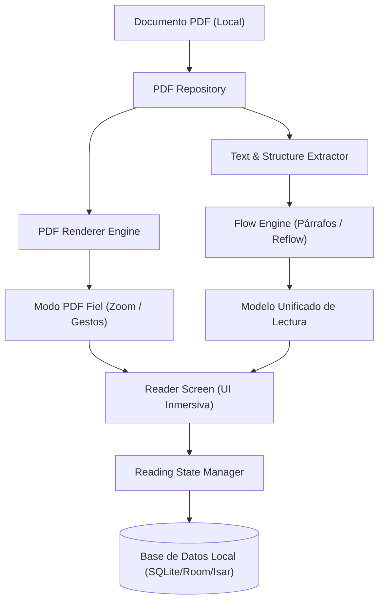

# Arquitectura Técnica de FlowPDF

## 1. Principio de Separación de Capas (Clean Architecture)

FlowPDF desacopla estrictamente el renderizado y procesado de archivos PDF de la capa de interfaz de usuario. Esto permite sustituir o mejorar el motor de PDF sin alterar la experiencia de usuario.

```
                FLOWPDF
                   │
        ┌──────────┴──────────┐
        │                     │
   PRESENTATION             CORE
        │                     │
   ┌────┼────┐          ┌─────┼─────┐
   │    │    │          │     │     │
 Home Library Reader   PDF   Text  Flow
                         │     │     │
                         └─────┼─────┘
                               │
                          Persistencia
                               │
                       Base de Datos Local
```

---

## 2. Flujo de Datos y Motores



---

## 3. Estructura de Directorios Recomendada

### Para Flutter (Dart):
```
lib/
├── core/
│   ├── constants/
│   ├── theme/               # Temas de lectura (Light, Paper, Dark, Amoled)
│   ├── typography/          # Fuentes Literata & Inter
│   └── utils/
├── data/
│   ├── database/            # Drift / Isar / SQFlite
│   ├── models/              # DTOs y Mappers
│   ├── pdf/                 # Motores de renderizado y extracción
│   └── repositories/        # Implementaciones de repositorios
├── domain/
│   ├── entities/            # Book, Bookmark, Highlight, Note, ReadingSettings
│   ├── repositories/        # Interfaces abstractas
│   └── usecases/            # Casos de uso: ImportBook, GetReadingProgress, etc.
└── presentation/
    ├── bookmarks/
    ├── home/                # Pantalla Inicio con tarjeta 'Continuar Leyendo'
    ├── library/             # Lista vertical con filtros
    ├── reader/              # Lector fullscreen, gestos y BottomSheet 'Aa'
    └── settings/
```

### Para Android Nativo (Kotlin + Jetpack Compose):
```
app/src/main/java/com/flowpdf/app/
├── core/
│   ├── ui/
│   ├── theme/
│   └── navigation/
├── data/
│   ├── database/            # Room DAOs & Entities
│   ├── pdf/                 # PdfRenderer + PdfTextExtractor
│   └── repository/
├── domain/
│   ├── model/
│   └── usecase/
└── feature/
    ├── home/
    ├── library/
    ├── reader/
    ├── bookmarks/
    └── settings/
```

---

## 4. El Motor "Flow Engine"

El diferencial clave de FlowPDF es transformar documentos rígidos en una experiencia de lectura líquida.

### Pipeline del Flow Engine:
1. **Extracción de Bloques:** Recorre las páginas identificando cajas delimitadoras de texto (*bounding boxes*).
2. **Detección y Fusión de Columnas:** Si detecta dos columnas paralelas, secuencia la lectura de la columna izquierda antes que la derecha en lugar de mezclar renglones.
3. **Normalización de Párrafos:** Une líneas rotas por saltos de carro del PDF (`\n` artificiales), preservando separaciones reales de párrafos.
4. **Detección de Jerarquías:** Clasifica fuentes por tamaño y peso para inferir títulos de capítulos y subtítulos.
5. **Generación del Flow DOM:** Emite una estructura de lectura continua con paginación virtual o scroll suave adaptado a la configuración seleccionada en el panel **Aa**.
